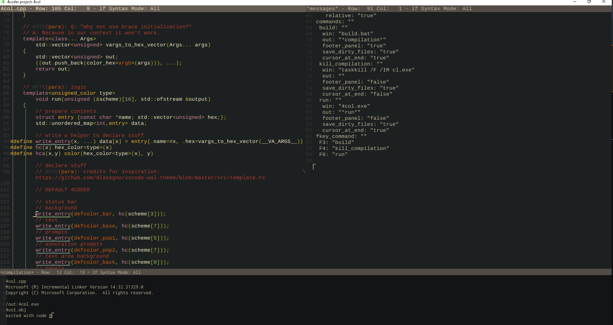
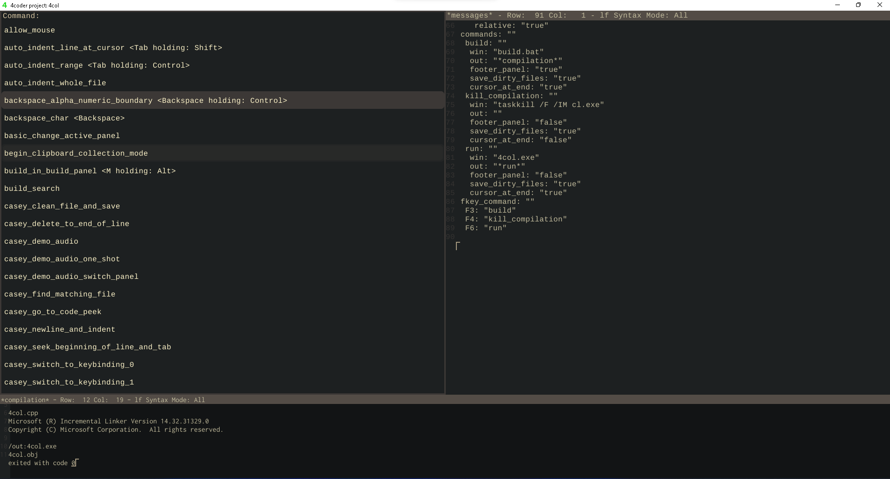
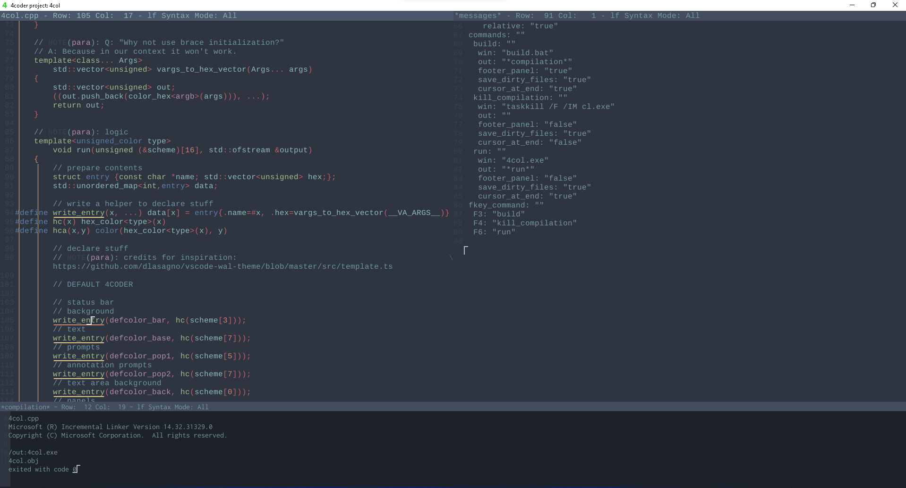
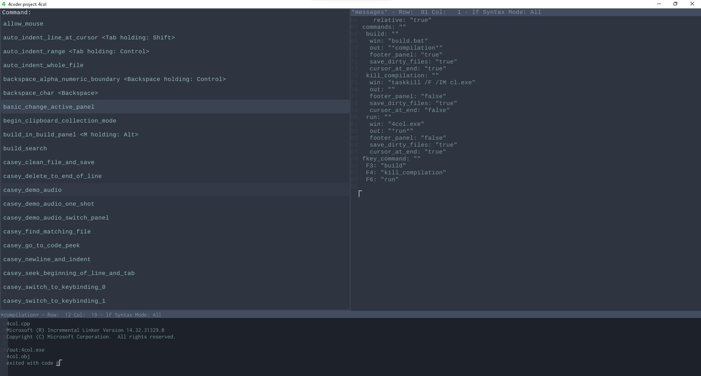

# 4col
4coder theme generator from base16 color schemes

# How-to
This is configured for my layer (a fork of Ryan Fleury's) [which you can find here](https://github.com/cristeigabriel/4coder_cgabe), but, in 4col.cpp there's instructions on how to adapt this application to work with your layer.
To modify the color scheme, you merely have to change the `#define COLOR`'s value to 2, and input your own base16 scheme, then, run `build.bat` and run `4col.exe`, which'll generate a file called `theme-autogenerated.4coder`. You can also use the default schemes, which are defined as such: 0 - `Grubox Dark` and 1 - Nord.

# Showcase
</img>
</img>
</img>
</img>

# Licensing
Do anything you want with this.
